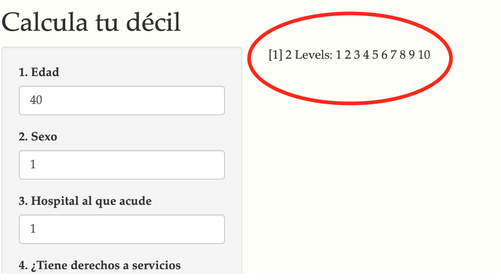

```{r setup, include=FALSE}
library(tufte)
# invalidate cache when the tufte version changes
knitr::opts_chunk$set(cache.extra = packageVersion('tufte'))
options(htmltools.dir.version = FALSE)
```

# Introducción

La creciente y persistente desigualdad en las sociedades y la aparente inhabilidad de los distintos modelos económicos tradicionales (capitalismo liberal al estilo estadounidense, capitalismo planificado al estilo chino, capitalismo intervencionista al estilo europeo o socialismo al estilo cubano) para disminuir dicha desigualdad, han impulsado un renovado interés en hacer investigación acerca de la movilidad (o inmovilidad) intergeneracional en distintos países. El enfoque parte de que existen condiciones fuera del control de cada uno de nosotros – como dónde nacemos, qué nivel educativo y qué ocupación tienen nuestros padres (por dar un par de ejemplos) – que influyen y en muchos casos incluso determinan el desempeño vital que tendremos. En ese sentido, nuestra habilidad de movernos de un decil o quintil de ingreso a otro no del todo depende sólo de nosotros.

Raj Chetty, connotado economista e investigador de la prestigiada universidad de Harvard, ha dedicado una parte importante de su vida académica a estudiar el fenómeno de movilidad intergeneracional estudiando por ejemplo si el famoso “sueño americano” sigue siendo una realidad^[Mira su artículo en [*The Atlantic*](https://www.theatlantic.com/magazine/archive/2019/08/raj-chettys-american-dream/592804/)]. En este “sueño” uno puede superar cualquier deficiencia o carencia determinada por la familia y entorno socioeconómico en el que nacemos mediante, básicamente, el acceso a la educación y la dedicación al trabajo: una meritocracia en el sentido más amplio de la palabra. Tu desempeño no es otra cosa que el resultado directo de tu mérito propio. Pero, ¿es esto una realidad?

Chetty ha usado sus conocimientos de teoría económica de la mano de análisis estadístico aprovechando el auge del “big data” y ha encontrado clara evidencia que el sueño americano es precisamente eso: un sueño. El porcentaje de niños estadounidenses que logran un nivel de ingreso mayor al de sus padres ha venido disminuyendo inexorablemente, al grado que hoy en día, sólo el 50% de los niños de ese país logra un nivel de ingreso mayor que el de sus padres.

Si eso sucede en uno de los supuestos bastiones de la movilidad intergeneracional: ¿qué pasa en México? ¿Qué papel juegan las “circunstancias” de nacimiento en las oportunidades de lograr un “brincar” del decil de ingreso de nuestros padres a uno más alto? 

No es sorpresa para nadie que México es un país con profundas desigualdades, y si esas desigualdades tienden a traducirse en menor movilidad intergeneracional no sólo se están perpetuando las desigualdades, también se está comprometiendo el crecimiento potencial de las personas. Los estudiosos de los temas de movilidad intergeneracional han encontrado evidencia que una movilidad baja puede ser tanto causa como consecuencia de una mayor desigualdad. Por el contrario, una mayor movilidad está normalmente asociada a patrones de desarrollo más incluyentes.

# Datos en México

Para analizar este fenómeno de movilidad intergeneracional para México nuestros especialistas analizaron los datos de la Encuesta de Movilidad ESRU-EMOVI del Centro de Estudios Espinoza Yglesias (CEEY) de 2017^[Te recomendamos echarle un ojo a los proyectos, publicaciones y datos que elabora el [*CEEY*](https://ceey.org.mx/contenido/que-hacemos/emovi/)]]. Esta encuesta entrevista a una muestra representativa de más de 17,000 personas entre 25 y 64 años de edad y recopila información sociodemográfica diversa del encuestado (por ejemplo edad, género, grado de escolaridad, características de su hogar actual, acceso a la salud, ocupación, etc) así como muchas de esas mismas variables para sus padres (escolaridad, ocupación, etc) y para el hogar en el que vivía cuando tenía 14 años (agua potable, pisos de cemento, etc). En la encuesta también se le pregunta al encuestado información que le permite a los especialistas aproximar el nivel de “riqueza” relativa del individuo hoy y cuando tenía 14 años (por ejemplo analizando qué aparatos electrodomésticos y electrónicos hay o había en el hogar, y qué servicios financieros tiene o tenía al alcance como tarjetas de crédito, cuentas bancarias, etc).

El objetivo de recabar toda esta información es poder evaluar en qué medida “origen es destino”, es decir comparar algunas variables dadas las circunstancias de la vida del encuestado a los 14 años (origen) con esas variables hoy (destino).

```{r shiny_app, echo=FALSE, message=FALSE, warning=FALSE}
library(knitr)
knitr::include_app('https://marcoyel21.shinyapps.io/data/', height = '600px')
```

Como podemos observar, a los 14 años el 35% de los encuestados vivía en localidades con menos de 2,500 habitantes (pueblos), mientras que poco más del 25% vivía en ciudades de más de 100,000 habitantes. La escolaridad máxima del 28% de los entrevistados es la primaria, 31% tiene secundaria, poco más del 18% tienen preparatoria, mientras que el 11.5% posee educación superior y posgrado. Si vemos la escolaridad de los padres, en los niveles básicos observamos una distribución de años de escolaridad similar tanto para el padre como la madre: en ambos casos más del 60% sólo tiene primaria, aproximadamente el 15% tiene secundaria. En los niveles de licenciatura y posgrado, son más los padres que alcanzan dicho nivel (casi 6% para los padres contra 2.9% para las madres con este grado de escolaridad). En cuanto al número de hijos: sólo el 4.44% de las madres tienen 1 sólo hijo, casi 37% tiene entre 2 y 4 hijos y llama la atención que hay un 18.7% que reportan haber tenido más de 9 hijos (siendo el máximo reportado de 24 hijos).

Con toda la información considerada relevante desde el punto de vista de la teoría económica  - que es el fuerte de nuestro equipo de especialistas  -  se construyeron algunos modelos econométricos (que para no aburrir al lector se encuentran disponibles en el anexo metodológico; y sí, son tan interesantes como su nombre lo indica). Estos modelos buscan (logran) predecir dadas ciertas características del individuo y de su origen qué probabilidad tendría de lograr un mejor destino que sus padres: es decir qué probabilidad tiene de lograr movilidad intergeneracional. 

El modelo evaluado busca predecir cuál sería la probabilidad de estar en un cierto decil de ingreso hoy dadas ciertas características del individuo que incluyen su origen (para la muestra considerada los parámetros incluyen en este caso: edad, años promedio de escolaridad propia y años promedio de escolaridad de los padres, número de habitaciones contando la cocina que tenía su hogar a los 14 años). En la siguiente tabla pueden verse dichas predicciones de probabilidad.

```{r  echo=FALSE, message=FALSE, warning=FALSE}
library(knitr)
library(readr)
library(kableExtra)
z<-read_csv("indi_final.csv")

kable(z,digits = 3) 
```      

Sin embargo, antes de avanzar con el blog y echarle un ojo a la herramienta que hemos construido, vale la pena saber en qué décil del ingreso te encuentras.

# ¿A qué decil pertenezco en México?

En 2018, el ingreso promedio por familia mexicana fue de 49 mil 610 pesos por trimestre, es decir, unos 16 mil 536 pesos al mes. Es una cifra menor a los 17 mil 249 pesos mensuales que ingresaron los hogares mexicanos en 2016, lo que representó una caída de 4.1%. Pero la disminución se dio solamente en los deciles de ingreso más altos. 

El Inegi ofrece el dato de ingreso corriente promedio trimestral por deciles de hogares, y para facilitar el cálculo te lo mostramos de manera mensual^[Sin embargo, no te detenemos, si tienes curiosidad sobre este tipo de información, y otras cosas que hace el INEGI, te recomendamos consultar la [*ENIGH*](https://www.inegi.org.mx/temas/ingresoshog/)]. Checa en qué nivel de ingresos está tu familia con la siguiente tabla.


```{r  echo=FALSE, message=FALSE, warning=FALSE}
y<-read_csv("decil.csv")
kable(y,format.args = list(big.mark = ","))
```

Como seguramente para estas alturas de este *post*, el lector muere de curiosidad por saber cuál podría ser su destino dado su origen, lo invitamos a utilizar [**nuestra herramienta interactiva para ello en este enlace**](https://marcoyel21.shinyapps.io/pred/). 

**NOTA IMPORTANTE:  Es muy recomendable tener la tabla del modelo probit del anexo estadístico a la mano para saber el significado de las etiquetas. El decíl calculado se muestra en la sección izquierda de la aplicación como se muestra en la siguiente imágen**




# Anexo Estadístico

## Modelo Probit 


```{r ,fig.margin = TRUE, echo=FALSE, message=FALSE, warning=FALSE}

sample<-read_csv("sample.csv")

library(MASS)
library(dplyr)
library(ggplot2)

probit <- polr(factor(objetivo) ~ p05+ factor(p06)+ factor(p09_1)
              + factor(p10_1)+ estatura
              + p21+ factor(p23)+ factor(p24)+ p28+ p38_11+ factor(p43)+
                p38m_11+ factor(p43m)+ p60+ p61+
                p64+ p86+ p87+ p98+
                p122+ p131+ p132+ p142+ p143+ p144+ 
                factor(p151)+ factor(region) +  factor(escolaridadh)+indigena, 
              sample, method = c("probit"))

sample<- sample%>% mutate(X4=as.numeric(predict(probit)),
                            probit_pred=ifelse(X4<4.216122,1,
                           (ifelse(X4<4.842813,2,
                            (ifelse(X4<5.289456,3, 
                            (ifelse(X4<5.675788,4,  
                             (ifelse(X4<6.051863 ,5, 
                              ifelse(X4<6.485439,6, 
                            (ifelse(X4<6.873794,7, 
                            (ifelse(X4<7.371822,8, 
                           (ifelse(X4<8.083650 ,9, 10)))))))))))))))))

#ahora resto valores predichos menos valores reales, si es cero quiere decir que le atinamos
library(ggthemes)
sample <- sample%>% mutate(count=X4-objetivo)

ggplot(sample, aes(x=count))+
  geom_histogram(color="darkblue", fill="lightblue")+theme_wsj()+ scale_colour_wsj("colors6")+
  ggtitle("Errores")


```


Recordemos un modelo probit intenta modelar la probabilidad condicional de que Y tome cierto valor dados los demás valores de X.

$$P(Y=J|X) = P( \alpha_J < X' \beta+ U_i)$$
$$=P(\alpha_J-X' \beta+ < U_i)= 1-\phi(\alpha_J-X' \beta)$$

De esta manera, estimamos el modelo con base en las variables seleccionadas. A la izquierda se muestra un histograma de los errores del modelo ($\hat{y}_i-y_i$) y, abajo, se listan las variables que se usaron, los signos y sus etiquetas.


```{r  echo=FALSE, message=FALSE, warning=FALSE}

x<-read_csv("coef.csv")
kable(x)%>%
  scroll_box(width = "600px", height = "1000px")
```

## Construcción de la variable objetivo

Para estimar la variable de ingreso de interés se utilizó un análisis factorial policórico (*Polychoric Principal Component Analysis*), utilizando por [*Solís (2018)*](link de solis). Este método también es conocido como análisis de componentes principales en una matriz de correlaciones policórica.

El análisis de PCA busca las variables latentes (factores) que explican la varianza de todas las variables que se utilizan en el modelo. Para este ejercicio, se utilizaron distintas variables de activos del hogar y el primer factor lo interpretamos como un proxy de ingreso/riqueza subyacente a las variables que se usaron para construirlo. El análisis hace que el primer factor sea el que más varianza explica (de las variables originales que usamos para construirlo), en este ejercicio cerca del **46% de la varianza**.

El valor predicho de ese primer factor para cada observación es el proxy de ingreso/riqueza y se obtuvo para el individuo a los 14 años y como se encuentra en la actualidad. Este proxy no es comparable entre ambos. Para corregir el error se utilizó el decil en el que se encontraba el individuo a los 14 años y en el que se encuentra actualmente. La diferencia en deciles representa la movilidad social de ese individuo, es decir, si la diferencia es positiva el individuo ascendió socialmente ya que se encuentra en un decil mayor, si la diferencia es cero, no hubo diferencia en la movilidad social y si la diferencia es negativa entonces el individuo descendió socialmente ya que se encuentra en un decil inferior al que estaba cuando tenía 14 años.

Las variables utilizadas en el PCA se tomaron de Solís (2018) y se eliminaron aquellas que contribuían poco al análisis para quedarnos con suficientes variables de tal manera que la varianza explicada del primer componente fuera suficientemente alta.^[Variables que se emplaron:
-agua entubada
-estufa
-televisión de paga
-refrigerador
-tostador
-teléfono fijo
-otra casa o departamento
-tierras para trabajo
-lavadora
-cuenta bancaria
-tarjeta debito
-tarjeta crédito
-material de piso
-hacinamiento]


## Trato del factor de expansión

La Base de datos cuenta con un factor de expansión de frecuencia, este factor indica a cuántas personas representa cada entrevistado en la encuesta en la población. Las estimaciones toman en cuenta este factor.


## Selección de variables

```{marginfigure}
Debido a que se contaban con casi 300 variables, muchas de las cuales posiblemente explican lo mismo, se optó por usar un método para reducir la dimensionalidad con base en el rango intercuantílico. El método consiste en estimar el rango intercuantilico de la base de datos y de cada variable y subsecuentemente eliminar aquellas que tengan un rango intercuartilico menor al global o una fracción arbitraria. De esta manera, se eliminan las variables con menor varianza despues de haber corregido por *outliers*. Aunque no sirvió de mucho para elegir variables, sirvió mucho para reducir el tamaño de la base de datos hasta a mas o menos 80 variables.

https://towardsdatascience.com/why-1-5-in-iqr-method-of-outlier-detection-5d07fdc82097
```
Se realizó una selección de variables en dos etapas: en la primera etapa se realizó una revisión de literatura y un análisis exploratorio inicial para elegir las variables más económicamente más importantes para el caso mexicano: la escolaridad de los padres, la escoladidad actual del individuo, el género, la etnicidad y la región donde vive.

En segundo lugar, para fortalecer el modelo se decidió hacer una segunda exploración de las variables pero ahora habiendo quitado las variables con menor varianza. De esta manera se realizó una segunda exploración ahora más "comoda" y sin tanto peso computacional.


## Trato de los missing values

A pesar de que la base de datos tenía menos del 10% de sus datos como *missing values*, dos variables contenían la gran mayoría de ellos, una de ellas vitla para el análisis: eduación del padre. Debido a que para estimar el modelo se necesitan observaciones completas, esto supuso una perdida grande de observaciones de incluso más del 50% por lo que se optó por rescatar observaciones mediante la inputación de valores en las variables que tenían menos del 8% de sus valores como faltantes.

Se decidió implementar una imputación de valores con base en [*la imputación con medidas de tendencia central*](https://heartbeat.fritz.ai/data-handling-scenarios-part-2-working-with-missing-values-in-a-dataset-34b758cfc9fa) aunque solamente con la media en el caso de los outliers de las variables númericas.

## Predicciones en la herramienta

Por último, solo cabe mencionar debido al peso computacional que tiene estimar el modelo para toda la base de datos (que en su versión expandida supera 40 millones de observaciones), y qué debido a que la herramienta la construimos sobre una *shiny app*, por lo que se está corriendo R de forma remota; las predicciones de la herramientan tienen su base en un modelo estimado al momento a partir de una muestra aleatoria de tamaño 10,000.


## Anexo de contribuciones 

El blog que se presenta fue un trabajo conjunto del equipo 3. A continuación se enlistan los integrantes así como la contribución de cada participante: 


* Alexa Gonzalez: limpieza de base de datos,  programación stata, elección de variables y de modelo. 

* Karen Hazan: redacción, análisis descriptivo, bibliografía, elección de variables y de modelo. 

* Marcelo Torres: limpieza de base de datos,  programación stata, elección de variables y de modelo.

* Marco Ramos: diseño y programación del blog en html, programación r, elección de variables y de modelo. 

* Mónica Contreras: limpieza de bases, análisis descriptivo stata, elección de variables y de modelo.


